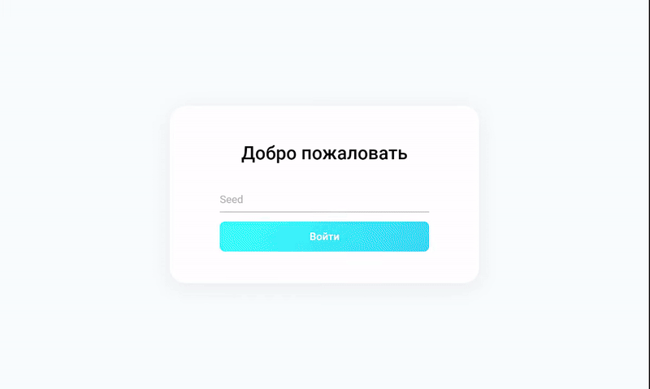

# Контакты - CRUD на основе Randomuser.me

Приложение учета контактов с примером Rest запроса. Пример применения React, RTK и методологии FSD

<p align="center">
    
</p>

 ## Попробовать
[WEB](https://wracce.github.io/contacts-app)

## Возможности

⚡ Вход по Seed

⚡ Сохранение Seed в LocalStorage

⚡ Получение пользователей с сервера

⚡ Добавление / Редактирование / Удаление контактов (без сервера)

 ## Скриншоты
 
<p align="center">
    
    
    
    
</p>

## Стек технологий

 * Vite, npm
 * TypeScript, Stylus
 * React, Redux, Redux Toolkit, RTK Query
 * Roboto
 * React-router, react-modal, classnames
 * Eslint, Prettier
 * FSD, BEM, SOLID

## Сборка / Запуск

1. Установка зависимостей

```bash
npm install
```

2. Запуск проекта

```bash
npm run dev
```

3. Сборка проекта

```bash
npm run build
```

## Лицензия
MIT license
